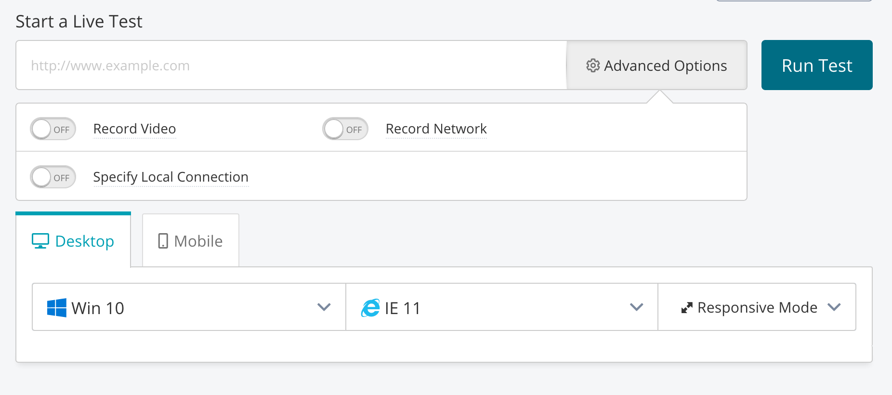

# Browser Support

The Dotcom web application aims to support a wide set of browsers. These are [configured](https://github.com/browserslist/browserslist) in `apps/site/assets/.browserslistrc`.

# Browser Testing

We use the [CrossBrowserTesting service](https://app.crossbrowsertesting.com/login) to interact with our website from a variety of different OS/browser setups. There is a login associated with web-tools@mbtace.com -- this is in the Shared-Website-Dev folder shared between devs on our LastPass account.

## Start a Live Test


If what you're testing is already deployed somewhere, you can use that URL here. You'll be prompted to specify your desired desktop OS or mobile device, web browser, and screen resolution. There are many choices!

## Testing locally

Testing on a locally running application requires slightly more setup. [CrossBrowserTesting offers a standalone tool you can download for this purpose](https://help.crossbrowsertesting.com/local-connection/general/using-packaged-local-connection-tool/).

Once downloaded and extracted, you can activate the tool on your command line as follows (you can view the command with your auth key by clicking the **Local Connection** link in the top navigation bar):

```
cbt_tunnel-macos-x64 --username web-tools@mbtace.com --authkey yourAuthKey
```

Then you can proceed with the test as normal! _NOTE_: the URL to use here will be "local" rather than "localhost", e.g. `http://local:4001/schedules/Green/line`.

Happy testing! 🎉
